# 🛡️ ZelC: The World's First Cybersecurity Programming Language

<div align="center">

```
███████╗███████╗██╗      ██████╗
╚══███╔╝██╔════╝██║     ██╔════╝
  ███╔╝ █████╗  ██║     ██║     
 ███╔╝  ██╔══╝  ██║     ██║     
███████╗███████╗███████╗╚██████╗
╚══════╝╚══════╝╚══════╝ ╚═════╝
```


### **When Code Stops Being Written—and Starts Being Spoken**

<br>

<table>
<tr>
<td align="center" width="33%">
<br>
<sub><b>Not a library. A language.</b></sub>
</td>
<td align="center" width="33%">
<br>
<sub><b>Built for AI operators</b></sub>
</td>
<td align="center" width="33%">
<br>
<sub><b>Proof is automatic</b></sub>
</td>
</tr>
</table>

**[📘 Learn More at rocheston.com/zelc](https://rocheston.com/zelc)**

</div>

---

## 🎨 **VISUAL OVERVIEW**

```mermaid
graph TB
    A[👤 Security Operator] -->|Natural Language| B[🤖 AINA Agent]
    B -->|Generates| C[⚡ ZelC Code]
    C -->|Executes Safely| D[🛡️ Zelfire Platform]
    D -->|Produces| E[📝 Cryptographic Evidence]
    E -->|Anchors to| F[⛓️ Rosecoin Ledger]
    
    style A fill:#ff6b6b,stroke:#c92a2a,stroke-width:3px,color:#fff
    style B fill:#4ecdc4,stroke:#0fb9b1,stroke-width:3px,color:#fff
    style C fill:#f9ca24,stroke:#f0932b,stroke-width:3px,color:#000
    style D fill:#a29bfe,stroke:#6c5ce7,stroke-width:3px,color:#fff
    style E fill:#ffa502,stroke:#ff7979,stroke-width:3px,color:#fff
    style F fill:#55efc4,stroke:#00b894,stroke-width:3px,color:#000
```

<div align="center">



</div>

---

## 🚨 **THE DECLARATION OF PRIORITY**

> ### ⚖️ **OFFICIAL NOTICE OF INVENTION**
>
> **On February 9, 2026, Haja Mo introduced ZelC to the world—**  
> **The FIRST Turing-complete programming language designed specifically for**  
> **Autonomous AI-Driven Cybersecurity Operations**

<div align="center">

| 🏆 **ACHIEVEMENT** | 📊 **SPECIFICATION** |
|:---|:---|
| **🎯 First Language** | Cybersecurity-native operations as primitives |
| **🤖 First Agent-Ready** | LLM-optimized syntax with intent validation |
| **📝 First Evidence-Native** | Cryptographic proof generation built-in |
| **🔒 First Kinetic-Safe** | Read-only by default execution model |
| **🌐 First Multi-Cloud Native** | AWS, Azure, GCP as language constructs |
| **⚡ First Speakable Security** | Natural language compiles to safe operations |

**[🌐 Official Documentation: rocheston.com/zelc](https://rocheston.com/zelc)**

</div>

---


### **HAJA MO**
**Founder & CTO, Rocheston**
<div align="center">
  <table width="100%" cellspacing="0" cellpadding="0" style="border-collapse: collapse; margin: 30px 0;">
    <tr>
      <td width="50%" align="center" valign="top" style="padding: 30px; border: 1px solid #444;">
          <br>
          <h2>🏆 <b>LEGACY</b></h2>
          <br>
          <p style="font-size: 1.2em; line-height: 2.2; margin: 0;">
              💡 Pioneered the term "Ethical Hacking"<br>
              🚀 Founded Rocheston (2015)
          </p>
          <br>
      </td>
      <td width="50%" align="center" valign="top" style="padding: 30px; border: 1px solid #444; background-color: #2b2b2b;">
          <br>
          <h2>⚡ <b>INNOVATION</b></h2>
          <br>
          <p style="font-size: 1.2em; line-height: 2.2; margin: 0;">
              🛡️ Rose X OS<br>
              🤖 AINA Operating System<br>
              ⛓️ Rosecoin Blockchain<br>
              💻 <b>ZelC Language</b>
          </p>
          <br>
      </td>
    </tr>
  </table>
</div>

</div>

> ### 💬 **Creator's Statement**
>
> *"The industry has been trying to solve 21st-century security problems with 20th-century tools. We're asking AI Agents to defend our infrastructure, but forcing them to write Python and Bash—languages with no concept of safety, evidence, or containment.*
>
> *I created ZelC to solve the **'Kinetic Gap.'** An AI Agent needs a language that prevents it from accidentally destroying the environment it's protecting. ZelC is that language. It's the safety layer for the Age of Agentic AI."*
>
> **— Haja Mo, February 9, 2026**

---

## 🎯 **THE FOUR REVOLUTIONARY INNOVATIONS**

```mermaid
graph LR
    A[🔥 ZelC Innovations] --> B[🛡️ Kinetic Safety]
    A --> C[📝 Evidence Types]
    A --> D[🎯 Intent System]
    A --> E[🗣️ Speakable Security]
    
    B --> B1[Read-Only by Default]
    B --> B2[do-block Isolation]
    B --> B3[Capability Gating]
    
    C --> C1[Native Data Type]
    C --> C2[Cryptographic Proof]
    C --> C3[Blockchain Anchoring]
    
    D --> D1[Agent Validation]
    D --> D2[Safety Constraints]
    D --> D3[Auto-Compliance]
    
    E --> E1[Natural Language]
    E --> E2[LLM-Optimized]
    E --> E3[Intent-to-Code]
    
    style A fill:#ff6b6b,stroke:#c92a2a,stroke-width:4px,color:#fff
    style B fill:#4ecdc4,stroke:#0fb9b1,stroke-width:3px,color:#fff
    style C fill:#f9ca24,stroke:#f0932b,stroke-width:3px,color:#000
    style D fill:#a29bfe,stroke:#6c5ce7,stroke-width:3px,color:#fff
    style E fill:#ffa502,stroke:#ff7979,stroke-width:3px,color:#fff
```

<div align="center">



</div>

### 🛡️ **INNOVATION #1: KINETIC SAFETY**

<table>
<tr>
<td width="50%">

#### ❌ **THE OLD WAY**
```python
# DANGEROUS: No safety boundaries
import os
import boto3

# This can delete production DB
# Just as easily as it rotates a key
# ZERO distinction between operations

ec2 = boto3.client('ec2')
ec2.terminate_instances(
    InstanceIds=['i-prod-critical']
)
# Oops. Production is gone.
```

<div align="center">


</div>

</td>
<td width="50%">

#### ✅ **THE ZelC WAY**
```zelc
check SecurityResponse
  // ═══════════════════════════════
  // SAFE ZONE: Analysis Only
  // No credentials required
  // AI agents explore freely
  // ═══════════════════════════════
  
  analyze threat_indicators
  calculate risk_score
  
  when risk_score > 90
    // ═════════════════════════════
    // KINETIC ZONE: Gated Actions
    // Requires explicit capability
    // All actions generate evidence
    // ═════════════════════════════
    do
      firewall block ip threat.source
      evidence record "Threat blocked"
    end
  end
end
```

<div align="center">


</div>

</td>
</tr>
</table>

---

### 📝 **INNOVATION #2: EVIDENCE AS A NATIVE TYPE**

<table>
<tr>
<td width="50%">

#### ❌ **THE OLD WAY**
```python
import logging

# Evidence = text logs
# Can be deleted
# Can be tampered with
# No chain-of-custody
# No cryptographic proof

logging.info(
    f"Blocked IP {ip_addr}"
)

# Good luck in court with this
```

<div align="center">


</div>

</td>
<td width="50%">

#### ✅ **THE ZelC WAY**
```zelc
evidence {
  action: "firewall_block"
  target: ip_address
  timestamp: now()
  operator: current_user
  
  // Automatic features:
  chain_of_custody: true
  crypto_signature: auto
  ledger_anchor: rosecoin
  
  compliance_mapping: [
    "NIST.IR-4",
    "SOC2.CC7.2",
    "ISO27001.A.16.1.5"
  ]
}
```

<div align="center">


</div>

</td>
</tr>
</table>

---

### 🎯 **INNOVATION #3: INTENT VALIDATION SYSTEM**

<table>
<tr>
<td width="50%">

#### ❌ **THE OLD WAY**
```python
# AI Agent generates code
# No validation until runtime
# Hallucinations cause failures

def isolate_hosts(hosts):
    # What if AI passes 1000 hosts?
    # What if it's production?
    # What if no approval?
    # What if no evidence?
    
    for host in hosts:
        shutdown(host)  # YOLO
```

<div align="center">


</div>

</td>
<td width="50%">

#### ✅ **THE ZelC WAY**
```zelc
intent Isolate {
  category: containment
  risk_level: medium
  reversible: true
  
  constraints {
    max_targets: 10
    time_limit: 2h
    preserve_state: true
    requires_approval: auto
    evidence_required: true
  }
  
  compliance: [
    "NIST.IR-4",
    "ISO27001.A.16.1.5"
  ]
}

// AI-generated code is validated
// BEFORE execution begins
```

<div align="center">


</div>

</td>
</tr>
</table>

---

### 🗣️ **INNOVATION #4: SPEAKABLE SECURITY**

<div align="center">

#### **Natural Language → Safe Operations**

```mermaid
sequenceDiagram
    participant H as 👤 Human Operator
    participant A as 🤖 AINA Agent
    participant Z as ⚡ ZelC Compiler
    participant S as 🛡️ Zelfire System
    participant E as 📝 Evidence Ledger
    
    H->>A: "Isolate that suspicious host<br/>and preserve forensics"
    
    Note over A: Generates ZelC code
    A->>Z: agent_command "isolate_with_forensics"
    
    Note over Z: Validates intent<br/>Checks constraints<br/>Verifies permissions
    Z->>Z: ✅ Intent validated<br/>✅ Target exists<br/>✅ Forensics supported
    
    Z->>S: Execute safe operation
    Note over S: Isolates host<br/>Preserves state<br/>Captures memory
    
    S->>E: Generate evidence
    Note over E: Cryptographic proof<br/>Blockchain anchor<br/>Compliance mapping
    
    E->>A: Evidence receipt
    A->>H: "Host isolated. Forensics preserved.<br/>Evidence ID: #47392"
    
    Note over H,E: Complete audit trail available
```

</div>



<div align="center">

| 🎤 **HUMAN SAYS** | ⚡ **ZelC EXECUTES** | 📝 **EVIDENCE GENERATED** |
|:---|:---|:---|
| "Block that suspicious IP" | `firewall block ip 10.0.0.1` | ✅ Action + Timestamp + Operator |
| "Isolate compromised hosts" | `endpoint isolate [h1, h2, h3]` | ✅ Forensic State + Chain-of-Custody |
| "Rotate all API keys" | `identity rotate_keys service_accounts` | ✅ Key IDs + Rotation Time + Compliance |
| "Generate compliance report" | `compliance report SOC2` | ✅ Control Mappings + Evidence Pack |

</div>

---

## 🧠 **THE KINETIC GAP PROBLEM**

<div align="center">

### **Why ZelC Had to Be Invented**

</div>

<table>
<tr>
<th width="33%" align="center">

### 🔴 **PROBLEM 1**
#### Safety Failure

</th>
<th width="33%" align="center">

### 🟠 **PROBLEM 2**
#### Evidence Failure

</th>
<th width="33%" align="center">

### 🟡 **PROBLEM 3**
#### Agentic Failure

</th>
</tr>
<tr>
<td valign="top">

**❌ Traditional Languages:**
- No distinction between safe/unsafe operations
- Root scripts can destroy anything
- Zero guardrails
- Everything equally dangerous

**✅ ZelC Solution:**
- Read-only by default
- `do` blocks isolate danger
- Capability-gated actions
- Runtime enforces safety

<div align="center">

</div>

</td>
<td valign="top">

**❌ Traditional Languages:**
- Logs are afterthoughts
- Text files, no proof
- Can be deleted/tampered
- No chain-of-custody
- Not court-admissible

**✅ ZelC Solution:**
- Evidence is native type
- Cryptographic receipts
- Blockchain anchored
- Immutable by design
- Compliance automatic

<div align="center">

</div>

</td>
<td valign="top">

**❌ Traditional Languages:**
- AI agents hallucinate
- Fake functions crash
- Wrong parameters fail
- Dangerous code executes
- No pre-validation

**✅ ZelC Solution:**
- Intent system validates
- Type checking strict
- Constraints enforced
- AI code verified
- Safe before execution

<div align="center">

</div>

</td>
</tr>
</table>

---

## 🏗️ **THE ROCHESTON ECOSYSTEM**

<div align="center">

### **ZelC Powers the Complete Security Stack**

```mermaid
graph TB
    subgraph OS["🖥️ OPERATING SYSTEMS"]
        RX[Rose X OS<br/>Security-Native]
        AI[AINA OS<br/>AI-Driven]
    end
    
    subgraph LANG["⚡ PROGRAMMING LAYER"]
        ZC[ZelC Language<br/>⭐ YOU ARE HERE]
    end
    
    subgraph PLAT["🛡️ SECURITY PLATFORMS"]
        ZF[Zelfire<br/>XDR · SOAR · IR]
        VB[Vega Browser<br/>Agentic Interface]
    end
    
    subgraph DATA["📊 DATA & COMPLIANCE"]
        RC[Rosecoin<br/>Evidence Ledger]
        RCF[RCF + Noodles<br/>Framework · Evidence]
    end
    
    subgraph AGENT["🤖 AI AGENTS"]
        AN[AINA Agent<br/>Natural Language]
    end
    
    OS --> LANG
    LANG --> PLAT
    LANG --> DATA
    AGENT --> LANG
    PLAT --> DATA
    
    style ZC fill:#f9ca24,stroke:#f0932b,stroke-width:5px,color:#000,font-weight:bold
    style RX fill:#ff6b6b,stroke:#c92a2a,stroke-width:3px,color:#fff
    style AI fill:#4ecdc4,stroke:#0fb9b1,stroke-width:3px,color:#fff
    style ZF fill:#a29bfe,stroke:#6c5ce7,stroke-width:3px,color:#fff
    style VB fill:#fd79a8,stroke:#e84393,stroke-width:3px,color:#fff
    style RC fill:#55efc4,stroke:#00b894,stroke-width:3px,color:#000
    style RCF fill:#ffeaa7,stroke:#fdcb6e,stroke-width:3px,color:#000
    style AN fill:#74b9ff,stroke:#0984e3,stroke-width:3px,color:#fff
```

</div>



<br>

| 🏗️ **COMPONENT** | 🎯 **PURPOSE** | 🔗 **ZelC INTEGRATION** |
|:---|:---|:---|
| **🖥️ Rose X OS** | Security-native operating environment | ZelC is the scripting language |
| **🤖 AINA OS** | AI operating system for agentic workflows | ZelC is AINA's execution language |
| **🛡️ Zelfire** | Security platform (firewall, XDR, SOAR, IR) | ZelC powers all automation |
| **⛓️ Rosecoin** | Blockchain for evidence anchoring | ZelC evidence types anchor here |
| **📋 RCF + Noodles** | Compliance framework + evidence system | ZelC generates compliant evidence |
| **🌐 Vega Browser** | Agentic web interface | ZelC scripts triggered from browser |

**[🌐 Complete Ecosystem Details: rocheston.com/zelc](https://rocheston.com/zelc)**

---

## 💻 **CODE COMPARISON: THE REVOLUTION**

### 🎯 **SCENARIO: Block Suspicious IP & Generate Evidence**

<table>
<tr>
<td width="50%">

#### ❌ **PYTHON (87 LINES)**

```python
import boto3
import requests
import json
import logging
from datetime import datetime
import hashlib

# Configure logging
logging.basicConfig(level=logging.INFO)
logger = logging.getLogger(__name__)

class FirewallManager:
    def __init__(self):
        self.ec2 = boto3.client('ec2')
        self.sg_id = 'sg-12345'  # Hard-coded
        
    def block_ip(self, ip_address):
        try:
            response = self.ec2.authorize_security_group_ingress(
                GroupId=self.sg_id,
                IpPermissions=[{
                    'IpProtocol': 'tcp',
                    'FromPort': 0,
                    'ToPort': 65535,
                    'IpRanges': [{
                        'CidrIp': f'{ip_address}/32'
                    }]
                }]
            )
            return True
        except Exception as e:
            logger.error(f"Failed: {e}")
            return False
    
    def generate_evidence(self, ip, action):
        # Manual evidence generation
        evidence = {
            'timestamp': datetime.now().isoformat(),
            'action': action,
            'target': ip,
            'operator': 'unknown',
            'hash': hashlib.sha256(
                f"{action}{ip}".encode()
            ).hexdigest()
        }
        # Write to file (can be deleted)
        with open('evidence.log', 'a') as f:
            f.write(json.dumps(evidence) + '\n')
        return evidence

def send_alert(message):
    webhook = os.getenv('SLACK_WEBHOOK')
    if webhook:
        requests.post(webhook, json={'text': message})

def main():
    fm = FirewallManager()
    suspicious_ips = ['192.168.1.100']
    
    for ip in suspicious_ips:
        if fm.block_ip(ip):
            evidence = fm.generate_evidence(ip, 'block')
            send_alert(f"Blocked {ip}")
            logger.info(f"Success: {ip}")
        else:
            send_alert(f"FAILED: {ip}")
            logger.error(f"Failed: {ip}")

if __name__ == '__main__':
    main()
```

<div align="center">

**❌ PROBLEMS**


</div>

</td>
<td width="50%">

#### ✅ **ZelC (9 LINES)**

```zelc
check ThreatResponse
  when suspicious_ips detected
    do
      firewall block ips suspicious_ips
      alert security_team "Blocked threats"
      evidence record "Threat mitigation"
    end
  end
end
```

<div align="center">

**✅ ADVANTAGES**


</div>

<br>

**🎯 WHAT ZelC HANDLES AUTOMATICALLY:**

✅ Evidence generation with crypto signatures  
✅ Blockchain anchoring to Rosecoin  
✅ Compliance mapping (NIST, SOC2, ISO)  
✅ Chain-of-custody tracking  
✅ Operator attribution  
✅ Timestamp immutability  
✅ Multi-cloud abstraction  
✅ Capability-based security  
✅ Rollback capability  
✅ Audit trail generation  

**ALL AUTOMATIC. ZERO BOILERPLATE.**

</td>
</tr>
</table>

---

## 🌟 **SYNTAX SHOWCASE**

<div align="center">

### **🎨 Visual Clarity Under Pressure**

*ZelC is designed to be readable at 3am during an active breach*

</div>

<table>
<tr>
<td width="50%">

#### 🎨 **EMOJI MODE** (Training/Documentation)

```zelc
🔴 alert HighSeverityThreat
  📊 analyze security_events
    🔍 where severity == "CRITICAL"
    ⏰ and timestamp > last_hour
  
  ⚠️ when threat_count > threshold
    💥 do
      🚨 notify security_team
      🔒 enable enhanced_monitoring
      📝 evidence create "Elevated threat"
    end
  end
end
```

<div align="center">


</div>

</td>
<td width="50%">

#### ⚡ **PRODUCTION MODE** (Standard Syntax)

```zelc
check ThreatHunting
  scan endpoints for iocs
  correlate with threat_intel
  
  when matches > 5
    do
      alert security_ops "Breach detected"
      isolate affected_endpoints
      preserve forensic_state
      evidence record "Threat hunting"
    end
  end
end
```

<div align="center">


</div>

</td>
</tr>
</table>

---

## 🔥 **REAL-WORLD USE CASES**

<div align="center">

### **From Intent to Execution in Seconds**

</div>

### 🚨 **USE CASE #1: RANSOMWARE RESPONSE**

```zelc
check RansomwareResponse
  monitor endpoints for ransomware_indicators
  
  when ransomware_detected
    do
      // ═══════════════════════════════════════
      // IMMEDIATE CONTAINMENT
      // ═══════════════════════════════════════
      endpoint isolate affected_hosts
      network segment_isolation affected_subnet
      
      // ═══════════════════════════════════════
      // FORENSIC PRESERVATION
      // ═══════════════════════════════════════
      memory_dump capture affected_hosts
      disk_snapshot preserve affected_volumes
      network_traffic capture last_30_minutes
      
      // ═══════════════════════════════════════
      // STAKEHOLDER NOTIFICATION
      // ═══════════════════════════════════════
      alert incident_response_team "RANSOMWARE ACTIVE"
      alert legal_team "Potential data breach"
      alert executive_team "Critical incident"
      
      // ═══════════════════════════════════════
      // AUTOMATIC EVIDENCE GENERATION
      // ═══════════════════════════════════════
      evidence record "Ransomware containment" {
        affected_systems: affected_hosts
        isolation_time: now()
        forensics_preserved: true
        compliance: ["GDPR.Art33", "NIST.IR-4"]
      }
    end
  end
end
```

<div align="center">


</div>

---

### ☁️ **USE CASE #2: MULTI-CLOUD SECURITY**

```zelc
check MultiCloudPosture
  // ═══════════════════════════════════════
  // SCAN ALL CLOUD PROVIDERS
  // ═══════════════════════════════════════
  scan all_clouds for security_gaps
  
  when critical_gaps detected
    do
      // AWS REMEDIATION
      cloud aws {
        security_group fix gaps.aws
        iam_policy enforce least_privilege
        encryption enable unencrypted_volumes
      }
      
      // AZURE REMEDIATION
      cloud azure {
        network_sg update gaps.azure
        rbac enforce minimum_permissions
        disk_encryption enable all_disks
      }
      
      // GCP REMEDIATION
      cloud gcp {
        firewall_rules fix gaps.gcp
        iam_bindings update excessive_permissions
        disk_encryption enable all_instances
      }
      
      // UNIFIED EVIDENCE
      evidence record "Multi-cloud remediation" {
        clouds: ["aws", "azure", "gcp"]
        gaps_fixed: gap_count
        compliance: ["CIS", "SOC2", "ISO27001"]
      }
    end
  end
end
```

<div align="center">


</div>

---

### 🎯 **USE CASE #3: AI-POWERED THREAT HUNTING**

```zelc
agent_workflow "advanced_threat_hunting" {
  // Human: "AINA, hunt for APT indicators"
  
  triggers: ["manual_invocation", "scheduled_daily"]
  
  steps {
    1. correlate_intelligence
    2. behavioral_analysis
    3. threat_scoring
    4. automated_response
  }
  
  do
    // INTELLIGENCE CORRELATION
    correlate [
      network_traffic,
      endpoint_telemetry,
      threat_intel_feeds,
      user_behavior
    ]
    
    // BEHAVIORAL ANALYSIS
    analyze patterns {
      lateral_movement: true
      privilege_escalation: true
      data_exfiltration: true
    }
    
    // THREAT SCORING
    calculate threat_score from [
      ioc_matches,
      behavior_anomalies,
      risk_indicators
    ]
    
    // GRADUATED RESPONSE
    when threat_score > 90
      // HIGH CONFIDENCE THREAT
      isolate matched_endpoints
      alert security_operations "Confirmed APT"
      evidence record "APT detection"
    end
    
    when threat_score between 50 and 90
      // MEDIUM CONFIDENCE
      enhance_monitoring matched_endpoints
      alert analyst_team "Requires investigation"
    end
  end
}
```

<div align="center">


</div>

---

## 🏆 **WHY THE GIANTS CAN'T BUILD THIS**

<div align="center">

### **The Incentive Problem**

```mermaid
graph TB
    Q[❓ Why Can't Tech Giants<br/>Build ZelC?]
    
    Q --> MS[Microsoft]
    Q --> GO[Google]
    Q --> AW[AWS]
    Q --> AP[Apple]
    Q --> VE[Security Vendors]
    
    MS --> MS1[❌ Would never make<br/>AWS & GCP first-class<br/>in Azure workflows]
    MS --> MS2[💰 Needs Azure lock-in<br/>for revenue]
    
    GO --> GO1[❌ Would never normalize<br/>Azure operations<br/>as equals to GCP]
    GO --> GO2[💰 Needs GCP preference<br/>for cloud business]
    
    AW --> AW1[❌ Would never treat<br/>their services as<br/>just one option]
    AW --> AW2[💰 Needs ecosystem lock-in<br/>for dominance]
    
    AP --> AP1[❌ Zero interest in<br/>enterprise multi-cloud<br/>operations]
    AP --> AP2[💰 Consumer-focused<br/>walled garden strategy]
    
    VE --> VE1[❌ Universal language<br/>threatens vendor<br/>lock-in model]
    VE --> VE2[💰 Needs proprietary APIs<br/>for license revenue]
    
    style Q fill:#ff6b6b,stroke:#c92a2a,stroke-width:4px,color:#fff
    style MS fill:#00d2d3,stroke:#0fb9b1,stroke-width:3px,color:#fff
    style GO fill:#f9ca24,stroke:#f0932b,stroke-width:3px,color:#000
    style AW fill:#ffa502,stroke:#ff7979,stroke-width:3px,color:#fff
    style AP fill:#a29bfe,stroke:#6c5ce7,stroke-width:3px,color:#fff
    style VE fill:#fd79a8,stroke:#e84393,stroke-width:3px,color:#fff
```

</div>



<br>

<table>
<tr>
<th>🏢 COMPANY</th>
<th>❌ WHY THEY CAN'T SHIP ZelC</th>
<th>💰 BUSINESS CONFLICT</th>
</tr>
<tr>
<td align="center"><b>Microsoft</b></td>
<td>Would never build a language that gives <b>first-class power to AWS and Google</b> inside Azure workflows</td>
<td>Azure revenue depends on lock-in</td>
</tr>
<tr>
<td align="center"><b>Google</b></td>
<td>Would never build tooling that <b>normalizes Azure governance</b> verbs as equal citizens to GCP</td>
<td>GCP adoption requires preference</td>
</tr>
<tr>
<td align="center"><b>AWS</b></td>
<td>Would never create a framework that <b>treats their services</b> as just one option among many</td>
<td>Market dominance needs ecosystem lock-in</td>
</tr>
<tr>
<td align="center"><b>Apple</b></td>
<td>Has <b>zero interest in enterprise</b> multi-cloud security operations</td>
<td>Consumer-focused, walled garden strategy</td>
</tr>
<tr>
<td align="center"><b>Security Vendors</b></td>
<td>A universal language <b>threatens vendor lock-in</b> on which their business depends</td>
<td>Proprietary APIs drive license revenue</td>
</tr>
</table>

<br>

<div align="center">

### **💡 The Rocheston Difference**

<table>
<tr>
<td align="center" width="50%">

#### ❌ **VENDOR INCENTIVES**
Lock you into their ecosystem  
Maximize their platform usage  
Protect proprietary advantage  
Limit portability  


</td>
<td align="center" width="50%">

#### ✅ **ROCHESTON INCENTIVES**
Help you succeed at security  
Maximize your operational capability  
Enable universal interoperability  
Ensure portability  


</td>
</tr>
</table>

**ZelC exists because Rocheston's business model is making security teams successful—**  
**not maximizing consumption of a proprietary cloud platform.**

**That alignment matters.**

</div>

---

## 📊 **COMPETITIVE LANDSCAPE**

<div align="center">

### **Where ZelC Stands Alone**

</div>

<table>
<tr>
<th>CATEGORY</th>
<th>LANGUAGE</th>
<th>PURPOSE</th>
<th>❌ LIMITATION</th>
<th>✅ ZelC DIFFERENCE</th>
</tr>
<tr>
<td rowspan="5"><b>Domain-Specific<br/>Security Languages</b></td>
<td><b>Zeek/Bro</b></td>
<td>Network monitoring</td>
<td>Passive analysis only, no remediation</td>
<td rowspan="5">✅ <b>Execute actions</b><br/>✅ <b>Generate evidence</b><br/>✅ <b>Agent-ready</b></td>
</tr>
<tr>
<td><b>Rego</b></td>
<td>Policy definitions</td>
<td>Declarative only, no execution</td>
</tr>
<tr>
<td><b>KQL/SPL</b></td>
<td>Log queries</td>
<td>Read-only queries</td>
</tr>
<tr>
<td><b>YARA</b></td>
<td>Malware detection</td>
<td>Pattern matching, no response</td>
</tr>
<tr>
<td><b>Sigma</b></td>
<td>Detection rules</td>
<td>Rules only, no operations</td>
</tr>
<tr>
<td rowspan="5"><b>General-Purpose<br/>Languages</b></td>
<td><b>Python</b></td>
<td>Everything</td>
<td>No security primitives, unsafe for agents</td>
<td rowspan="5">✅ <b>Security-native</b><br/>✅ <b>Evidence types</b><br/>✅ <b>Kinetic safety</b></td>
</tr>
<tr>
<td><b>Bash</b></td>
<td>Quick scripts</td>
<td>No type safety, extremely fragile</td>
</tr>
<tr>
<td><b>PowerShell</b></td>
<td>Windows automation</td>
<td>Platform-locked, no universal evidence</td>
</tr>
<tr>
<td><b>Go</b></td>
<td>Tools/services</td>
<td>For building tools, not operator workflows</td>
</tr>
<tr>
<td><b>Rust</b></td>
<td>Performance-critical</td>
<td>Steep learning curve, not operator-friendly</td>
</tr>
</table>

<br>

<div align="center">

### 🎯 **FEATURE COMPARISON MATRIX**

| FEATURE | Traditional<br/>Languages | Domain-Specific<br/>Languages | **ZelC** |
|:---|:---:|:---:|:---:|
| **Security Primitives** | ❌ | 🟡 Limited | ✅ **Native** |
| **Evidence Generation** | ❌ | ❌ | ✅ **Automatic** |
| **Kinetic Safety** | ❌ | N/A | ✅ **do-blocks** |
| **Agent-Friendly** | ❌ | ❌ | ✅ **Intent-validated** |
| **Multi-Cloud Native** | ❌ | ❌ | ✅ **First-class** |
| **Compliance Mapping** | ❌ | ❌ | ✅ **Automatic** |
| **Rollback Capability** | ❌ | ❌ | ✅ **Built-in** |
| **Court-Admissible Evidence** | ❌ | ❌ | ✅ **Cryptographic** |
| **Can Execute Actions** | ✅ | ❌ | ✅ **Safely** |
| **Can Read/Analyze** | ✅ | ✅ | ✅ **Plus Evidence** |


</div>

---

## 🚀 **THE PARADIGM SHIFT**

<div align="center">

### **From Application Languages to Security Operations Languages**

</div>


<br>

<table>
<tr>
<th width="50%">

### 💡 **THE JAVA MOMENT (1990s)**

</th>
<th width="50%">

### ⚡ **THE ZelC MOMENT (2020s)**

</th>
</tr>
<tr>
<td valign="top">

**When James Gosling created Java:**

> *"We already have C++,*  
> *why do we need another language?"*

**Because the paradigm shifted.**

The internet era needed:
- ✅ Write once, run anywhere
- ✅ Automatic memory management
- ✅ Built-in security model
- ✅ Platform independence

Java wasn't "better C++"—  
It was a **different foundation**  
for a **different era**.

<div align="center">

</div>

</td>
<td valign="top">

**Haja Mo created ZelC because:**

> *"We already have Python,*  
> *why do we need another language?"*

**Because the paradigm shifted again.**

The agentic AI era needs:
- ✅ State intent, execute safely
- ✅ Automatic evidence generation
- ✅ Built-in compliance mapping
- ✅ Ecosystem independence

ZelC isn't "better Python"—  
It's a **different foundation**  
for a **different era**.

<div align="center">

</div>

</td>
</tr>
</table>

---

## 🎓 **THE CERTIFICATION CRISIS**

<div align="center">

### **PDFs, Exams, and the Illusion of Competence**

</div>

<table>
<tr>
<td width="50%" bgcolor="#fff3cd">

#### ❌ **THE CERTIFICATION ECONOMY**

**How most certifications work:**

1. 📄 Vendor sells PDF book
2. 📖 You memorize definitions
3. ✍️ You pass multiple-choice exam
4. 🎓 You're "certified"

**Can you actually:**
- ⚡ Contain a live breach?
- 🔒 Execute forensically sound isolation?
- 📝 Generate court-admissible evidence?
- ⚖️ Prove compliance on demand?

**OR CAN YOU JUST:**
- 📚 Recite what NIST defines as "containment"?

<div align="center">


</div>

</td>
<td width="50%" bgcolor="#d1f2eb">

#### ✅ **ROCHESTON'S OPERATIONAL STANDARDS**

**How RCCE certification works:**

1. 🖥️ Access to Rose X OS
2. 🤖 Train with AINA Agent
3. ⚡ Write ZelC automation
4. 🛡️ Use Zelfire platform
5. 🔍 Hunt with Vulnerability Vines
6. **📊 Demonstrate operational capability**

**You must actually:**
- ⚡ Contain simulated breaches
- 🔒 Execute verified isolation
- 📝 Generate compliant evidence
- ⚖️ Prove what you did

**NOT JUST:**
- 📚 Memorize textbook answers

<div align="center">


</div>

</td>
</tr>
</table>

<br>

<div align="center">

### 💡 **ROCHESTON'S POSITION**


**That's why frameworks (RCF), evidence systems (Noodles), provenance (Rosecoin),**  
**and automation languages (ZelC) belong together.**

**Not as "content." As infrastructure.**

</div>

---

## 🛣️ **ROADMAP TO THE FUTURE**


<br>

<div align="center">

| 📅 **PHASE** | 🎯 **STATUS** | 🚀 **DELIVERABLES** |
|:---|:---:|:---|
| **Phase 1: Foundation** | ✅ **COMPLETE** | Language spec · Compiler · Runtime · Evidence system · Zelfire integration |
| **Phase 2: AINA Integration** | 🔄 **IN PROGRESS** | Speakable commands · Intent validation · Agent safety · Natural language compilation |
| **Phase 3: Ecosystem** | 📅 **Q3 2026** | Multi-cloud · EDR/XDR/SIEM · Ticketing · Identity · Universal integrations |
| **Phase 4: Production** | 📅 **Q4 2026** | Performance · Error handling · Distributed execution · Enterprise tooling |
| **Phase 5: Community** | 📅 **2027** | Open spec · Certification · Training · Marketplace · Standards submission |

</div>

---

## 📚 **LEARN MORE**

<div align="center">

### **🌐 Complete Documentation & Resources**

<br>

<table>
<tr>
<td align="center" width="25%">

### 🌐 **WEBSITE**
[](https://rocheston.com/zelc)

**Complete language documentation**  
**Tutorials & examples**  
**Community resources**

</td>
<td align="center" width="25%">

### 📖 **SPECIFICATION**
[](https://rocheston.com/zelc)

**Full language reference**  
**Syntax guide**  
**API documentation**

</td>
<td align="center" width="25%">

### 🎓 **TRAINING**
[](https://rocheston.com/zelc)

**ZelC programming courses**  
**Hands-on labs**  
**RCCE certification**

</td>
<td align="center" width="25%">

### 💬 **COMMUNITY**
[](https://rocheston.com/zelc)

**Developer forums**  
**Technical support**  
**Collaborate with peers**

</td>
</tr>
</table>

<br>

### 📫 **CONTACT CHANNELS**

<table>
<tr>
<td align="center" width="33%">

#### 🏢 **FOR ORGANIZATIONS**
Security teams interested in ZelC

**[security-teams@rocheston.com](mailto:security-teams@rocheston.com)**

</td>
<td align="center" width="33%">

#### 👨‍💻 **FOR DEVELOPERS**
Join the ZelC development effort

**[careers@rocheston.com](mailto:careers@rocheston.com)**

</td>
<td align="center" width="33%">

#### 🔬 **FOR RESEARCHERS**
Academic collaboration opportunities

**[research@rocheston.com](mailto:research@rocheston.com)**

</td>
</tr>
</table>

</div>

---

## 📄 **INTELLECTUAL PROPERTY & LICENSE**

<div align="center">

### **⚖️ PROPRIETARY TECHNOLOGY OF ROCHESTON**

<br>

**Copyright © 2026 Rocheston. All rights reserved.**

</div>

<table>
<tr>
<td width="50%">

### 📋 **INVENTION DETAILS**

**Inventor:** Haja Mo  
**Organization:** Rocheston  
**Date of Genesis:** February 9, 2026  
**Category:** Cybersecurity Programming Language  
**Status:** Proprietary, Production Integration

**This repository serves as:**
- ✅ Public notice of invention
- ✅ Claim of priority for ZelC
- ✅ Documentation of first-to-market
- ✅ Intellectual property protection

</td>
<td width="50%">

### 💼 **LICENSING & USAGE**

**Commercial Licensing:**  
[licensing@rocheston.com](mailto:licensing@rocheston.com)

**Academic Research:**  
Contact research team for collaboration

**Enterprise Deployment:**  
Contact sales for implementation

**Developer Access:**  
Available through RCCE program

</td>
</tr>
</table>

<br>

<div align="center">


</div>

---

## 🙏 **ACKNOWLEDGMENTS**

<div align="center">

### **Standing on the Shoulders of Giants**

</div>

ZelC honors the pioneers who showed us what programming language innovation looks like:

<table>
<tr>
<td align="center" width="25%">

**James Gosling**  
*Creator of Java*

For demonstrating what a  
paradigm shift looks like


</td>
<td align="center" width="25%">

**Dennis Ritchie & Ken Thompson**  
*Creators of C & Unix*

For portable systems  
programming philosophy


</td>
<td align="center" width="25%">

**Guido van Rossum**  
*Creator of Python*

For readability and  
developer experience principles


</td>
<td align="center" width="25%">

**Graydon Hoare**  
*Creator of Rust*

For memory safety and  
systems innovation


</td>
</tr>
</table>

<br>

**Special thanks to:**
- 🛡️ The entire cybersecurity community for two decades of hard-won lessons
- 👥 The Rocheston team who believed in this vision when it was just an idea
- 🚀 Early adopters and testers who are helping refine ZelC in production environments
- 🌍 The open-source community whose tools and libraries inspire better engineering

---

## 🎯 **THE CLOSING STATEMENT**

<div align="center">

### **The Next Language Is Not General-Purpose**

</div>

**ZelC is not here to replace Python, Rust, C++, or Java in their native territories.**

Those languages will continue doing what they do best—building applications, processing data, running systems. They're excellent at those jobs, and they're not going anywhere.

**ZelC is here to replace the most dangerous thing in modern cybersecurity:**

> ### **AD-HOC AUTOMATION**
>
> Glue scripts nobody owns  
> Half-documented runbooks  
> Scattered integrations  
> "Tribal knowledge" disguised as tooling  
> Bash scripts that work until they don't  
> Python automation only Dave understands  
> And Dave left six months ago  

<br>

**The next generation of security programming must be:**

<table>
<tr>
<td align="center" width="25%">

### 🤖
**Agent-Friendly**

AI can execute safely  
Intent-validated code  
No hallucination risks

</td>
<td align="center" width="25%">

### 📝
**Evidence-Native**

Cryptographic proof automatic  
Blockchain-anchored  
Court-admissible by default

</td>
<td align="center" width="25%">

### 🔒
**Capability-Aware**

Security operations first-class  
Kinetic safety built-in  
Read-only by default

</td>
<td align="center" width="25%">

### 🌐
**Multi-Everything**

Cloud-agnostic operations  
Vendor-independent  
Universal integrations

</td>
</tr>
</table>

<br>

**That is the thesis behind ZelC.**

**That is why Rocheston built it.**

Because cybersecurity doesn't need another library.

**It needs a new operating layer—**

> Where **intent** becomes **execution**,  
> **execution** becomes **evidence**,  
> and **evidence** becomes **trust**.

<br>

<div align="center">

### 🗣️ **TALK TO AINA AND GET IT SECURED**

**That's not a slogan.**

**That's the direction.**

<br>


# ⚡ ZelC: The Kinetic Cybersecurity Language

[-blue?style=for-the-badge&logo=adobeacrobatreader)](./ZELC_TECHNICAL_REPORT.pdf)


For the formal definition of **Kinetic Semantics**, **Blast Radius Analysis**, and the **Agentic Conformance Predicate**, please refer to the official specification:

👉 **[ZELC_TECHNICAL_REPORT.pdf](./ZELC_TECHNICAL_REPORT.pdf)** (33 Pages)
<br><br>
## 👤 **THE VISIONARY: HAJA MO**
<br><br>
<div align="center">

```
███████╗███████╗██╗      ██████╗
╚══███╔╝██╔════╝██║     ██╔════╝
  ███╔╝ █████╗  ██║     ██║     
 ███╔╝  ██╔══╝  ██║     ██║     
███████╗███████╗███████╗╚██████╗
╚══════╝╚══════╝╚══════╝ ╚═════╝

THE WORLD'S FIRST CYBERSECURITY PROGRAMMING LANGUAGE
```

<br>


<br>

**[🌐 Learn More: rocheston.com/zelc](https://rocheston.com/zelc)**

<br>
<br>

---

<sub>This document was created on February 9, 2026, as the definitive claim of priority for ZelC,  
the world's first cybersecurity-native programming language designed for agentic AI operations.</sub>

<sub>Inventor: Haja Mo | Organization: Rocheston | All Rights Reserved © 2026</sub>

</div>
